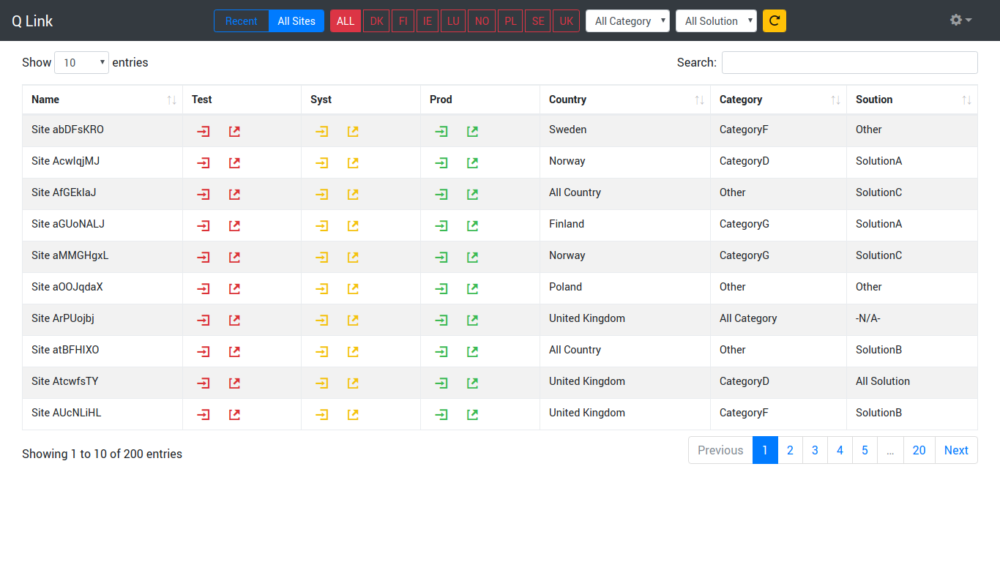

# quicklink
Quicklink is MVC app written in Django, which can be used to store certain depend upon some classification.

## Getting Started
1. Make sure your system has python3.5 or above installed.
1. If virtualenv is not installed, install virtualenv using command `pip install virtualenv`
1. Create a virtualenv say **quicklink**, using command `virtualenv quicklink`
1. Activate your virtual env using command `source ./quicklink/bin/activate`
1. Install below dependency in virtualenv  
Django==2.2.1  
django-widget-tweaks==1.4.3  
pytz==2019.1  
sqlparse==0.3.0  
1. run `./manage.py makemigrations`
1. run `./manage.py migrate`
1. Finally you can run the application using command `./manage.py runserver 8000`

##Screenshot

